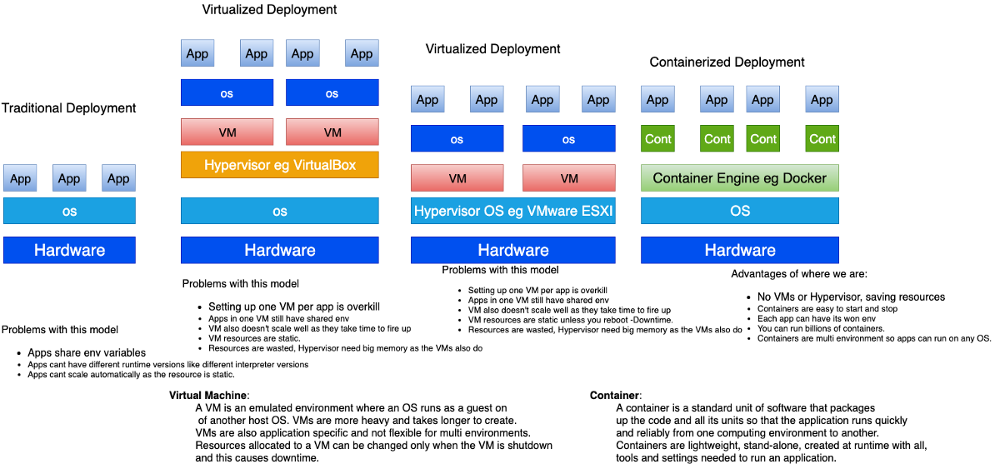
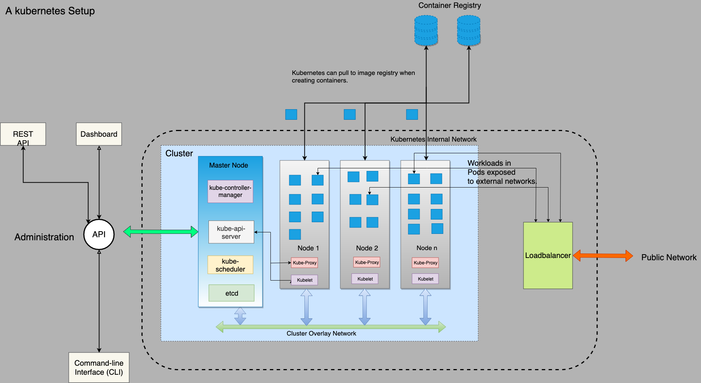

# Part 1

Used in this series are [Kubernetes](https://kubernetes.io) version 1.15 and [Minikube](https://kubernetes.io/docs/setup/learning-environment/minikube/) 1.2.0. The information here comes from several resources mainly [Kubernetes official docs](https://kubernetes.io/docs) and [Google Kubernetes engine docs](https://cloud.google.com/kubernetes-engine/docs/). We will also use [Google Kubernetes Engine (GKE)](https://cloud.google.com/kubernetes-engine), [Amazon Elastic Kubernetes Service (EKS)](https://aws.amazon.com/eks/) and [Azure Kubernetes Service (AKS)](https://azure.microsoft.com/en-in/services/kubernetes-service/) as the main managed services for Kubernetes we want to understand at the end of the course.

I will attach several links in this series for your further reading and curiosity but the content here also has enough to get you going just fine.

We will also use NodeJS for our REST API applicationnnnnn and ReactJS for our frontenddddddd. You will only deploy as we are not learning Node or React. Things will be the same when using any other runtime like Ruby, Python, Elixir etc.

## The Journey

During this series, we will study Kubernetes covering the following Topics:

1. Introductions - Definitions, History, Architecture - Part 1.
2. [Minikube](https://kubernetes.io/docs/setup/learning-environment/minikube/) and [Kubectl](https://kubernetes.io/docs/reference/kubectl)- Part 1.
3. [Workloads](https://kubernetes.io/docs/concepts/workloads)- Part 2
4. [Services and Service networking](https://kubernetes.io/docs/concepts/services-networking) - Part 3.
5. [Storages ](https://kubernetes.io/docs/concepts/storage)- Part 4.
6. [Configuration ](https://kubernetes.io/docs/concepts/configuration)- Part 5.
7. [Cluster Administration](https://kubernetes.io/docs/concepts/cluster-administration) - Part 6.
8. [Security](https://kubernetes.io/docs/concepts/security) and [Policies ](https://kubernetes.io/docs/concepts/policy)- Part 7.
9. [Scheduling ](https://kubernetes.io/docs/concepts/scheduling)- Part 7.
10. [Extending Kubernetes](https://kubernetes.io/docs/concepts/extend-kubernetes) - Part 8.

## Let's get started!

[Kubernetes](https://kubernetes.io/) popularly written as k8s is an [open-source](https://en.wikipedia.org/wiki/Open-source_software) [container](https://en.wikipedia.org/wiki/Operating-system-level_virtualization) [orchestration](https://en.wikipedia.org/wiki/Orchestration_(computing)) system for automating [application](https://en.wikipedia.org/wiki/Application_software) deployment, scaling, and management using containers. Kubernetes was originally developed by Google and later open-sourced with the first release in 2014 and is at the time of writing this article managed by [Cloud Native Computing Foundation](https://en.wikipedia.org/wiki/Cloud_Native_Computing_Foundation). This course covers Kubernetes in nearly its entirety. After this course, you will understand Kubernetes and be able to deploy and manage containers with Kubernetes at any scale.

## History of Kubernetes.

### Before Containers

Before [containers](https://www.docker.com/resources/what-container) became a thing, applications were deployed using VMs or directly on the OS. This had problems numerous problems and limitations like cost, efficiency, scalability, portability among others that demanded a new flexible way of deployment leading to the birth of containers and then Kubernetes.

[Containers](https://www.docker.com/resources/what-container) were in use before Kubernetes was in existence and became even more adopted with the creation of [Docker](https://www.docker.com/) which was initially released in 2013. Docker was great and solved many problems faced by the teams at the time including [microservice architecture](https://en.wikipedia.org/wiki/Microservices), [scaling](https://en.wikipedia.org/wiki/Scalability), [continuous deployment](https://en.wikipedia.org/wiki/Continuous_deployment) among others but there was a problem of managing containers.[ Google had been deploying large scale containers using some Pre-Kubernetes tools that gave birth to Kuberntes](https://queue.acm.org/detail.cfm?id=2898444) and that's another story on its own. In just 5 years, Kubernetes has been adopted by all major cloud vendors like AWS, IBM, Oracle, and Azure with some vendors tweaking to create their own versions. Kubernetes now has a vibrant community with good support and documentation and support for different container engines including [rkt](https://coreos.com/rkt/) and [Docker](https://www.docker.com/).

### Kubernetes Architecture.

Kubernetes is written in [Go-lang](https://golang.org/), a statically typed, [compiled](https://en.wikipedia.org/wiki/Compiled_language) programming language designed also at [Google](https://en.wikipedia.org/wiki/Google). Let's have a look inside Kubernetes.

A setup of Kubernetes consists of a cluster made up of a master node and worker nodes that work together to run your workflows/tasks/applications and manage the state of your cluster while communicating over a network managed by Kubernetes. The master manages the state of the cluster while the nodes run your applications in containers. The master node and worker nodes can be VMs or even actual servers.

The master runs certain processes that manipulate the other nodes. These processes provide the API for interacting with the cluster state, watching and changing cluster state and scheduling and keeping track of resource requirements, status and policies for running each workload.

The workers run the workloads or applications represented in the cluster state. The container images for running your workloads are stored in a container registry like [gcr.io](http://gcr.io) and [docker.io](docker.io). The containers are run in an internal network and exposed to the external networks using load balancers.

As you can see, the master node is accessible via the Kubernetes REST API, CLI tools or the Dashboard which still uses the REST API and nodes run containers that are started and stopped by the master and exposed out of the internal network via some load balancer.
While the master node runs 4 primary services:
- [Kube-apiserver](https://kubernetes.io/docs/admin/kube-apiserver/) - a service that validates and configures data for the API objects which include pods, services, replication controllers, and others. The API Server exposes REST operations and provides the frontend to the cluster's shared state through which all other components interact.
- [Kube-controller-manager](https://kubernetes.io/docs/admin/kube-controller-manager/) - a daemon that embeds the core control loops shipped with Kubernetes.
- [Kube-scheduler](https://kubernetes.io/docs/admin/kube-scheduler/) - a policy-rich, topology-aware, workload-specific function that significantly impacts availability, performance, and capacity.
- [etcd ](https://etcd.io/docs) - a Consistent and highly-available key-value store used as Kubernetes' backing store for all cluster data.

Each non-master node runs two services:
- [Kubelet ](https://kubernetes.io/docs/admin/kubelet/)- which communicates with the Kubernetes Master.
- [Kube-proxy](https://kubernetes.io/docs/admin/kube-proxy/) - a network proxy which reflects Kubernetes networking services on each node.

## Why use Kubernetes?

Kubernetes has several benefits that include all the benefits of using containers. Imagine you have a very complex application that requires realtime monitoring, micro-service architecture, continuous deployment, load balancing, security, auto-scaling, multi-cloud seamless deployment and I can't exhaust them, Kubernetes makes it super easy to achieve all of that. So in a nutshell, here are some of the benefits of using Kubernetes:
- Realtime monitoring of workloads - Logs provisioning, status checks are accessible through K8s API.
- Highly resilient infrastructure - As Kubernetes monitors containers it makes a resilient infrastructure that is elastic with recovery.
- Zero downtime deployment capabilities - Kubernetes replaces containers seamlessly without any downtime.
Automatic rollback, scaling, and self-healing - Changes made my Kubernetes can be rolled back seamlessly while scaling can be done automatically without any downtime.
- Micro-Services architecture - You can run segments of your application in units as containers that communicated through the Kubernetes network layer to work together.
- Large scale container deployment - Kubernetes can manage a large number of containers efficiently and easily.

## Use cases of Kubernetes.

As much Kubernetes can be used to deploy any kind of application, I would like to put down where Kubernetes works.
1. Realtime deployments.
When your application requires real-time deployment automatically using CI/CD, Kubernetes works well as it can pull new images and replace containers without any downtime and exposes an API for manipulating pods automatically.
2. Distributed workloads.
Kubernetes is very useful when you want to run distributed tasks on different containers as you manage the containers together.
3. Self-healing and Scaling services.
K8s is also perfect when your application requires auto-scaling and self-healing as Kubernetes will keep check of containers health and load. When the load hits the threshold, Kubernetes will add nodes to server your load. It will also keep track of container status and kill and replace containers with errors with no downtime.
4. Hybrid and Multicloud applications.
There are reasons why you may run your app in a multi-cloud mode in which case Kubernetes can run clusters in the different cloud for you with so much easy management.
5. Serverless Applications.
Kubernetes community has frameworks for running serverless applications like [Kubeless](http://kubeless.io/) and [Fission](http://fission.io/).
6. Microservices.
You split your code into components that run separately in different Kubernetes services and are interconnected and managed separately with Kubernetes.

## Understanding Kubernetes Components.

As we have already understood Kubernetes and how it works internally, now we will look at Kubernetes components that it exposes to us to make a cluster work. I have found learning by doing to be the best way of learning so moving forward, we will actually start using Kubenetes and interacting with it.

### Minikube and Kubectl.
