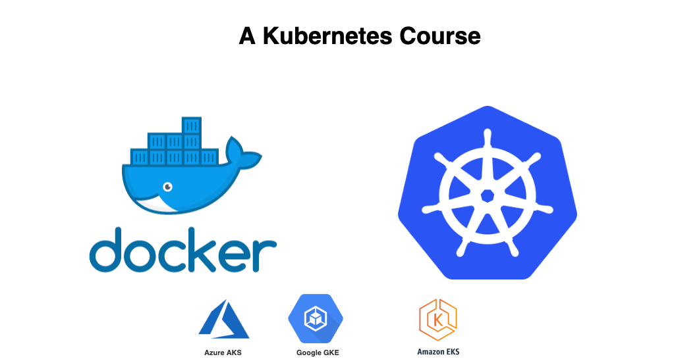
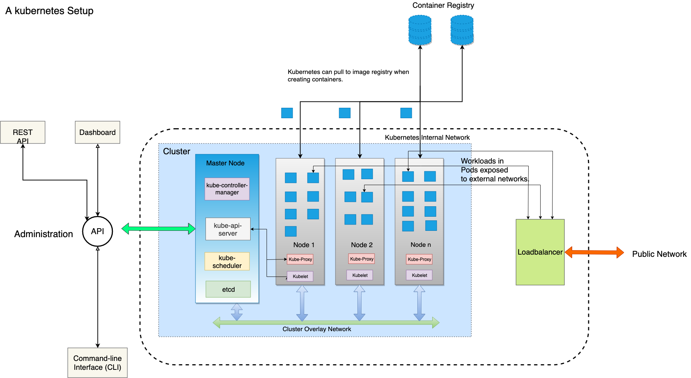

# Part 1

## History of Kubernetes.

### Before Containers

Before [containers](https://www.docker.com/resources/what-container) became a thing, applications were deployed using VMs or directly on the OS. This had problems numerous problems and limitations like cost, efficiency, scalability, portability among others that demanded a new flexible way of deployment leading to the birth of containers and then Kubernetes.


[Containers](https://www.docker.com/resources/what-container) were in use before Kubernetes was in existence and became even more adopted with the creation of [Docker](https://www.docker.com/) which was initially released in 2013. Docker was great and solved many problems faced by the teams at the time including [microservice architecture](https://en.wikipedia.org/wiki/Microservices), [scaling](https://en.wikipedia.org/wiki/Scalability), [continuous deployment](https://en.wikipedia.org/wiki/Continuous_deployment) among others but there was a problem of managing containers.[ Google had been deploying large scale containers using some Pre-Kubernetes tools that gave birth to Kuberntes](https://queue.acm.org/detail.cfm?id=2898444) and that's another story on its own. In just 5 years, Kubernetes has been adopted by all major cloud vendors like AWS, IBM, Oracle, and Azure with some vendors tweaking to create their own versions. Kubernetes now has a vibrant community with good support and documentation and support for different container engines including [rkt](https://coreos.com/rkt/) and [Docker](https://www.docker.com/).


### Kubernetes Architecture.

Kubernetes is written in [Go-lang](https://golang.org/), a statically typed, [compiled](https://en.wikipedia.org/wiki/Compiled_language) programming language designed also at [Google](https://en.wikipedia.org/wiki/Google). Let's have a look inside Kubernetes.

A setup of Kubernetes consists of a cluster made up of a master node and worker nodes that work together to run your workflows/tasks/applications and manage the state of your cluster while communicating over a network managed by Kubernetes. This also includes a few addons that are used for intercoms, management and logs. The master manages the state of the cluster while the nodes run your applications in containers. The master node and worker nodes can be VMs or even actual servers.

The master runs certain processes that manipulate the other nodes. These processes provide the API for interacting with the cluster state, watching and changing cluster state and scheduling and keeping track of resource requirements, status and policies for running each workload.

The workers run the workloads or applications represented in the cluster state. The container images for running your workloads are stored in a container registry like [gcr.io](http://gcr.io) and [docker.io](docker.io). The containers are run in an internal network and exposed to the external networks using load balancers.



As you can see, the master node is accessible via the Kubernetes REST API, CLI tools or the Dashboard which still uses the REST API and nodes run containers that are started and stopped by the master and exposed out of the internal network via some load balancer.

While the master node runs 4 primary services:

- [Kube-apiserver](https://kubernetes.io/docs/admin/kube-apiserver/) - a service that validates and configures data for the API objects which include pods, services, replication controllers, and others. The API Server exposes REST operations and provides the frontend to the cluster's shared state through which all other components interact.
- [Kube-controller-manager](https://kubernetes.io/docs/admin/kube-controller-manager/) - a daemon that embeds the core control loops shipped with Kubernetes.
- [Kube-scheduler](https://kubernetes.io/docs/admin/kube-scheduler/) - a policy-rich, topology-aware, workload-specific function that significantly impacts availability, performance, and capacity.
- [etcd ](https://etcd.io/docs) - a Consistent and highly-available key-value store used as Kubernetes' backing store for all cluster data.
- Container Runtime - This is the software that runs containers that are managed by kubernetes. The most popular you you may guess is Docker.

Each non-master node runs two services:

- [Kubelet ](https://kubernetes.io/docs/admin/kubelet/)- which communicates with the Kubernetes Master.
- [Kube-proxy](https://kubernetes.io/docs/admin/kube-proxy/) - a network proxy which reflects Kubernetes networking services on each node.

And the setup usually includes addons like:

- DNS - This is a DNS server that provides DNS functions to the services in a cluster and all containers started by kubernetes includes this DNS server as part of their DNS search options by default.
- [Dashboard](https://kubernetes.io/docs/tasks/access-application-cluster/web-ui-dashboard/) - A cluster also provisions a web ui for management and troubleshooting of the cluster applications and its children.
- [Container Resource Monitoring](https://kubernetes.io/docs/tasks/debug-application-cluster/resource-usage-monitoring/) - Kubernetes also provides container resource monitoring addons by recording generic time-series metrics about containers in a central database, and provides a UI for browsing that data.
- [Cluster-level Logging](https://kubernetes.io/docs/concepts/overview/components/#cluster-level-logging)- This is  mechanism responsible for saving container logs to a central log store with search/browsing interface.

## Why use Kubernetes?

Kubernetes has several benefits that include all the benefits of using containers. Imagine you have a very complex application that requires realtime monitoring, micro-service architecture, continuous deployment, load balancing, security, auto-scaling, multi-cloud seamless deployment and I can't exhaust them, Kubernetes makes it super easy to achieve all of that. So in a nutshell, here are some of the benefits of using Kubernetes:
- Realtime monitoring of workloads - Logs provisioning, status checks are accessible through K8s API.
- Highly resilient infrastructure - As Kubernetes monitors containers it makes a resilient infrastructure that is elastic with recovery.
- Zero downtime deployment capabilities - Kubernetes replaces containers seamlessly without any downtime.
Automatic rollback, scaling, and self-healing - Changes made my Kubernetes can be rolled back seamlessly while scaling can be done automatically without any downtime.
- Micro-Services architecture - You can run segments of your application in units as containers that communicated through the Kubernetes network layer to work together.
- Large scale container deployment - Kubernetes can manage a large number of containers efficiently and easily.


## Use cases of Kubernetes.

As much Kubernetes can be used to deploy any kind of application, I would like to put down where Kubernetes works.
1. Realtime deployments.
When your application requires real-time deployment automatically using CI/CD, Kubernetes works well as it can pull new images and replace containers without any downtime and exposes an API for manipulating pods automatically.
2. Distributed workloads.
Kubernetes is very useful when you want to run distributed tasks on different containers as you manage the containers together.
3. Self-healing and Scaling services.
K8s is also perfect when your application requires auto-scaling and self-healing as Kubernetes will keep check of containers health and load. When the load hits the threshold, Kubernetes will add nodes to server your load. It will also keep track of container status and kill and replace containers with errors with no downtime. b.bb. . 
4. Hybrid and Multicloud applications.
There are reasons why you may run your app in a multi-cloud mode in which case Kubernetes can run clusters in the different cloud for you with so much easy management.
5. Serverless Applications.
Kubernetes community has frameworks for running serverless applications like [Kubeless](http://kubeless.io/) and [Fission](http://fission.io/).
6. Microservices.
You split your code into components that run separately in different Kubernetes services and are interconnected and managed separately with Kubernetes.

## Understanding Kubernetes Components.

As we have already understood Kubernetes and how it works internally, now we will look at Kubernetes components that it exposes to us to make a cluster work. I have found learning by doing to be the best way of learning so moving forward, we will actually start using Kubenetes and interacting with it.


### Minikube, Kubectl

*Minikube* is a tool that makes it easy to run Kubernetes locally. Minikube runs a single-node Kubernetes cluster inside a Virtual Machine (VM) on your laptop for users looking to try out Kubernetes or develop with it day-to-day. This is because running a Kubernetes cluster on local environment is resource consuming and has alot of setup and configuration overhead that i better done on a staging or production environment. Both Kubernetes and Minikube expose the tools needed to interact with a cluster. It also supports almost all the Kubernetes [features](https://kubernetes.io/docs/setup/learning-environment/minikube/#minikube-features) that we may want to learn. Anything that is not supported on Minikube we will learn on the cloud managed services and on the Kubernetes cluster that we will create.

To install Minikube just checkout this [link](https://kubernetes.io/docs/tasks/tools/install-minikube/). If the link is broken, browser to Kubernetes official docs.

*Kubectl* is a command- line utility available to us for interacting with a Kubernetes API while doing deploying applications, monitoring etc. Kubectl basically manipulates the objects that represent the state of the cluster. We will see this in action in the next part of this series. 

## Kubernetes Objects

Now we understand the inner workings of kubernetes, lets look at the entities that represent the state of the cluster. *[Kubernetes Objects](https://kubernetes.io/docs/concepts/overview/working-with-objects/kubernetes-objects/)* are persistent entities in the Kubernetes system. Kubernetes uses these entities to represent the state of your cluster and its these objects that we manipulate to change the cluster. Specifically, they can describe properties of workloads, services among other object types. Lets look at the significant of these properties that we will be using moving forward.

### Object Spec and Status

*Spec* - This property represents the characteristics of the object as we desire them.
*Status* - This property describes the actual state of the object, and is supplied and updated by the Kubernetes system
For example, a Kubernetes Deployment is an object that can represent an application running on your cluster. When you create the Deployment, you might set the Deployment spec to specify that you want three replicas of the application to be running. The Kubernetes system reads the Deployment spec and starts three instances of your desired application–updating the status to match your spec. If any of those instances should fail (a status change), the Kubernetes system responds to the difference between spec and status by making a correction–in this case, starting a replacement instance

When using Kubectl command line utility, we mostly provide the object representation on a *.yaml* file. Kubectl converts the .yaml JSON when calling Kubernetes API. Lets see an example of a .yaml file.

```yaml
apiVersion: apps/v1 # for versions before 1.9.0 use apps/v1beta2
kind: Deployment
metadata:
  name: nginx-deployment
spec:
  selector:
    matchLabels:
      app: nginx
  replicas: 2 # tells deployment to run 2 pods matching the template
  template:
    metadata:
      labels:
        app: nginx
    spec:
      containers:
      - name: nginx
        image: nginx:1.7.9
        ports:
        - containerPort: 80
```
Don't worry about what the above .yaml file will create within kubernetes as we will talk about them until you start dreaming about them.

While creating a k8s object representation,. there are some required fields that must be specified and these include:
- apiVersion - Which version of the Kubernetes API you’re using to create this object
- kind - What kind of object you want to create
- metadata - Data that helps uniquely identify the object, including a name string, UID, and optional namespace
- spec - The precise format of the object spec is different for every Kubernetes object, and contains nested fields specific to that object.  For example, the spec format for a Pod can be found [here](https://kubernetes.io/docs/reference/generated/kubernetes-api/v1.16/#podspec-v1-core), and the spec format for a Deployment can be found [here](https://kubernetes.io/docs/reference/generated/kubernetes-api/v1.16/#deploymentspec-v1-apps).
  
Lets now look at ways to manage the objects while inside a cluster.

### Kubernetes Object Management

## Conclusion

We have come to the end of this part. I hope you have now seen the big picture of where K8s comes in in the DevOps chain and what cool things it can do. Lets meet and start deploying some [workloads](https://workloads.part). I love cloud native 🚀 🚀 🚀 🚀
