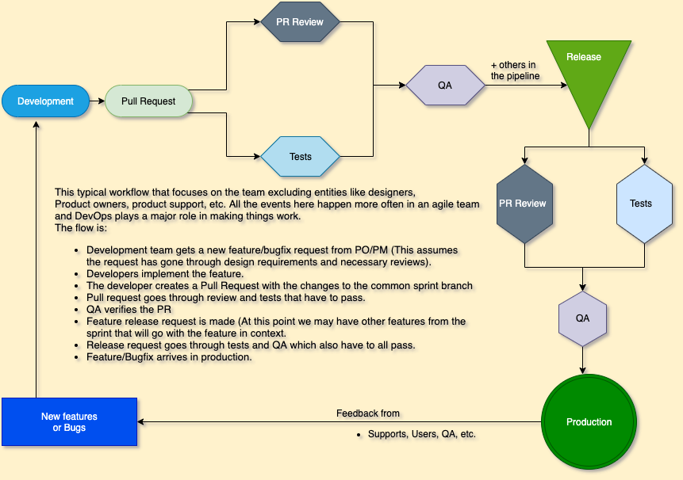

# Let's learn the new GitHub actions.

I recently took a path on PluralSight called [Understanding DevOps](https://www.pluralsight.com/paths/understanding-devops) which led me into a deeper understanding of the importance of DevOps and its benefits to teams and business needs. The ability to ship software fast, with less friction while still maintaining security, stability and efficiency is not easy without having a clear end to end setup of automation on all workflow levels from conception of ideas or features all the way to production and back.

